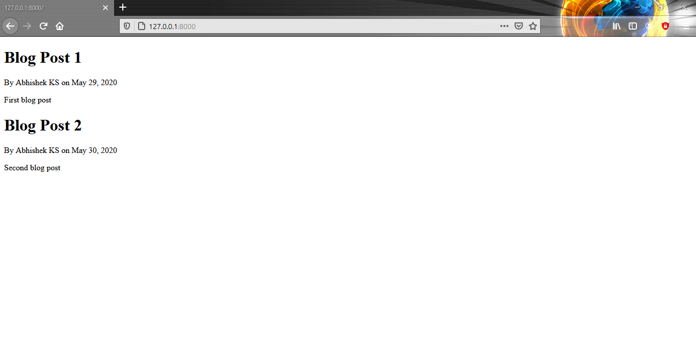
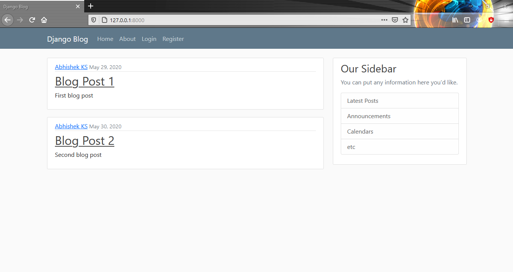
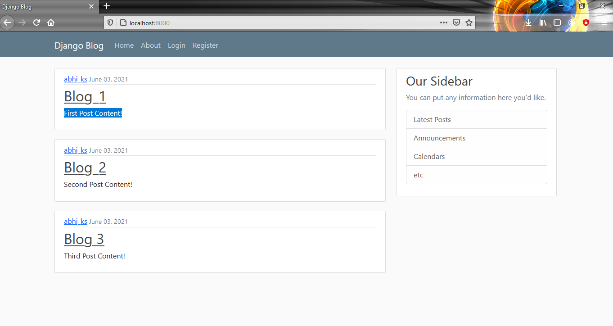
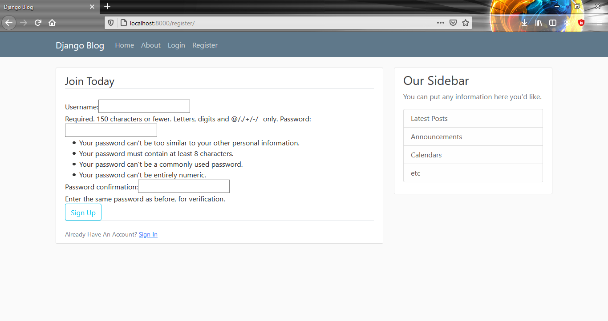
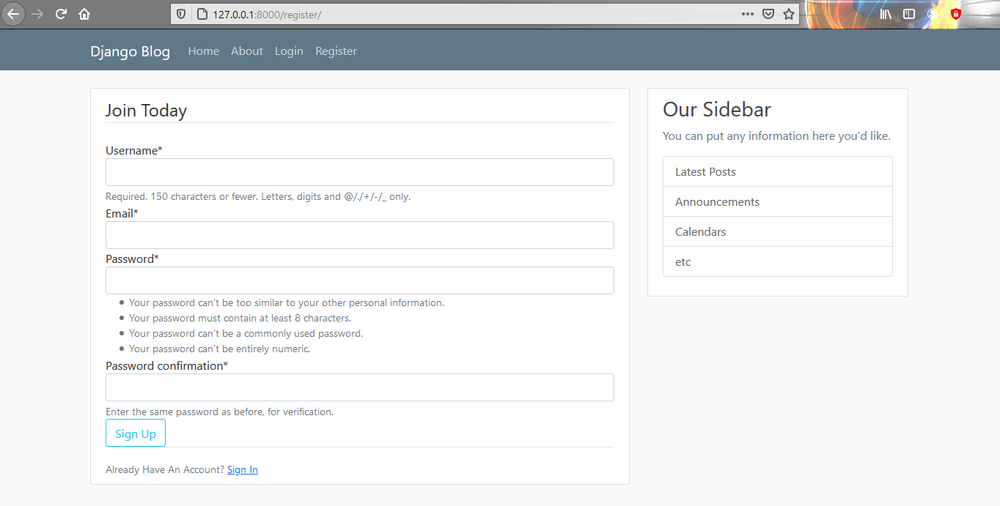
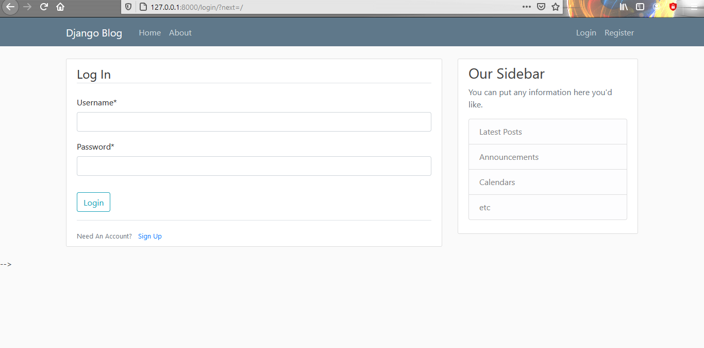
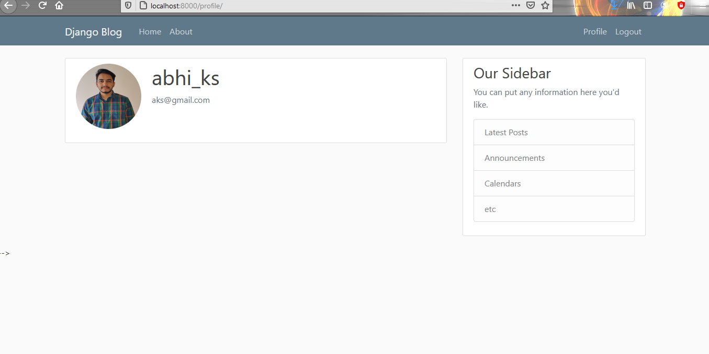
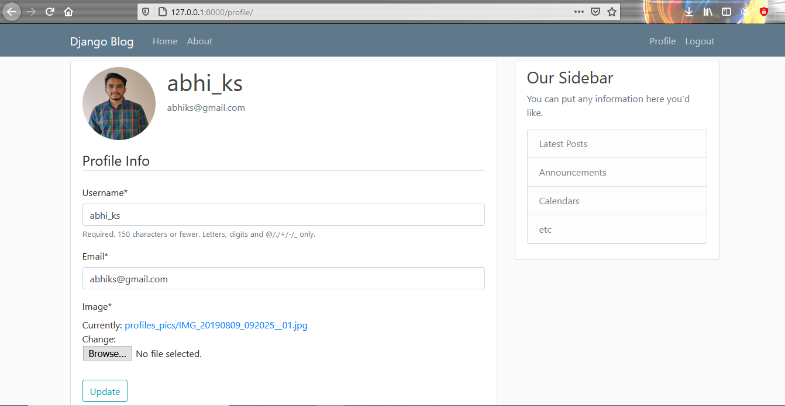
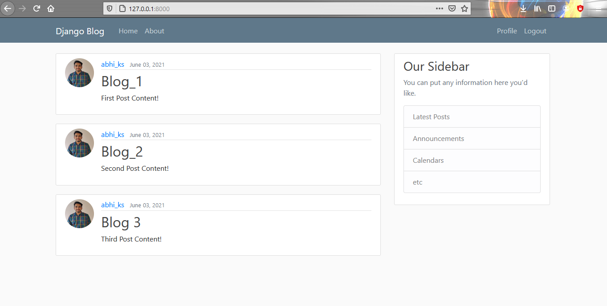

## Blog Post Website 

## Installations

- Python version -> 3.8.7

- pip install requirements.txt
	
## Project Features

- User Registration form to create new account.
- Only superuser can access Admin page.
- Profile user can view & update his details.
- User has to login to create, update & delete a post.
- Only Author of post can Update & Delete the post.
- User can see specific author all posts.
- User can Reset the password through Email sending link to user.

### Current status Visuals

## Project is completed so once i deploy it to cloud i will share website link ASAP!!

